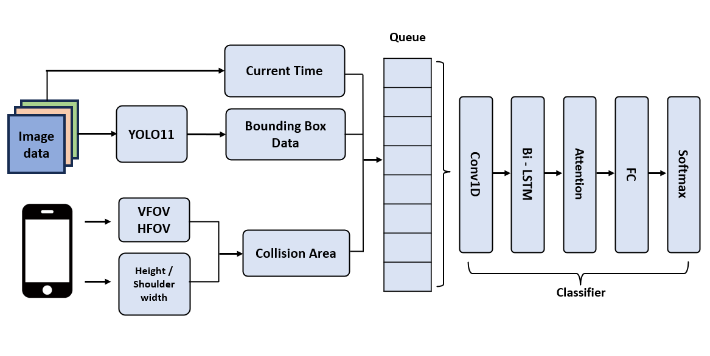
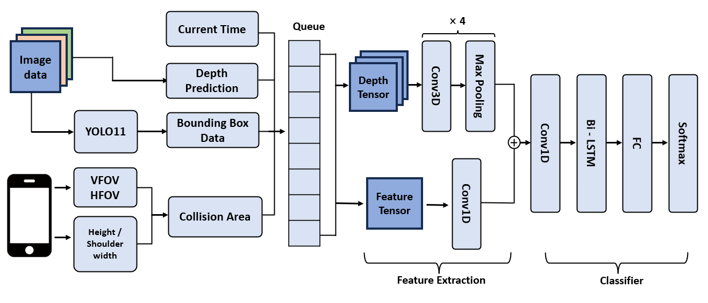
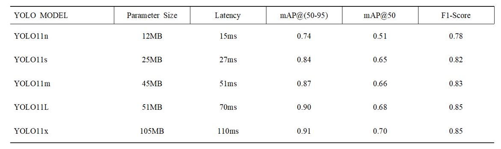
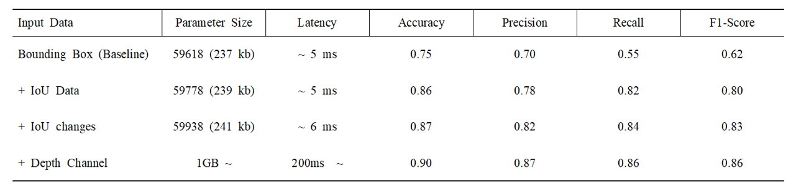
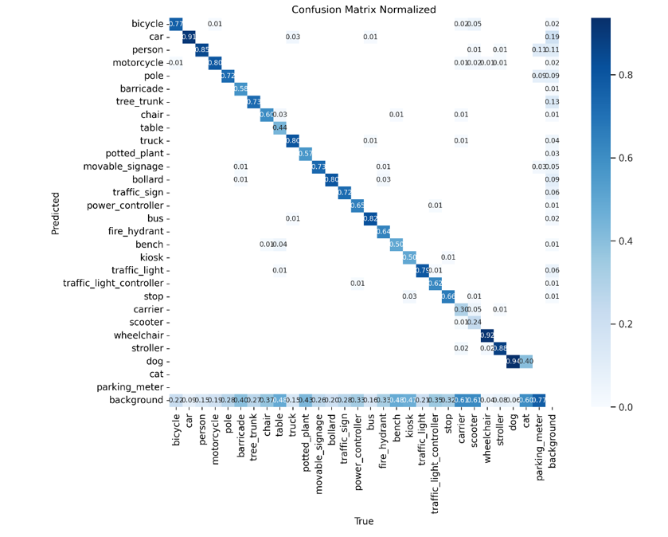
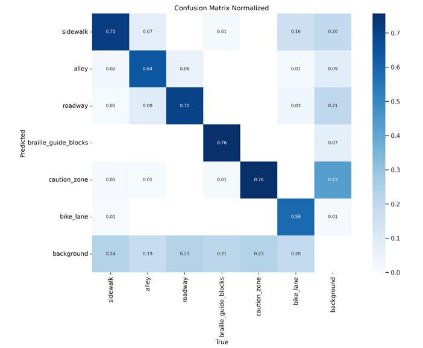
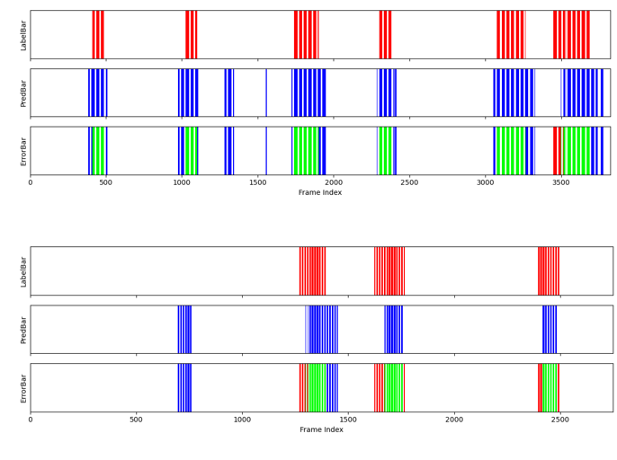
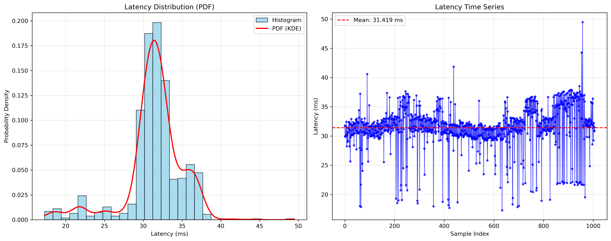
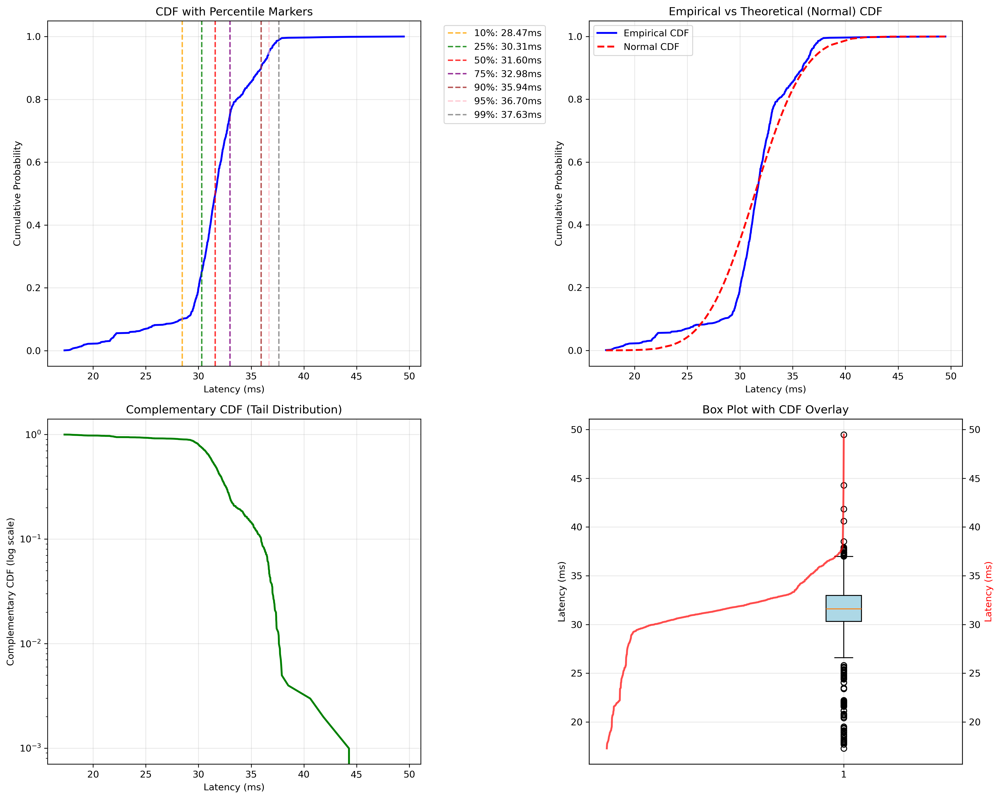

# 🧠 EYEPATH AI: Real-Time Collision Risk Prediction for the Visually Impaired

> **Project**: AI-Powered Assistive Navigation  
> **Department**: Mobile System Engineering, Dankook University  
> **Course**: Embedded System  
> **Contributors**: Kim Woosung, Lee Youngjoo, Lim Seokbeom

---

## 📌 Objective

This project aims to develop a **real-time collision risk prediction system** for visually impaired individuals. While white canes and guide dogs offer basic physical navigation support, they fall short in proactively warning users of fast-approaching or indirect obstacles.  

EYEPATH’s AI system addresses this limitation by integrating **object detection, depth estimation, spatial context extraction, and temporal modeling** to anticipate collisions **2–5 seconds in advance**, issuing proactive feedback via smartphone vibration or audio alerts.

---

## 🧠 System Overview

The AI pipeline processes image frames captured from a mobile device in real time, detecting objects, identifying collision-prone regions based on user parameters and field-of-view, and running inference through a deep temporal classifier.

---

## 🔍 Model Architecture

### Final Real-Time Model



The final architecture prioritizes **inference speed** and **mobile compatibility**:

- **YOLOv11n** for lightweight object detection
- **IoU-based features** extracted over a time queue (sliding window)
- Temporal modeling via **Conv1D → Bi-LSTM → Attention → FC → Softmax**

> **Latency: ~21ms** end-to-end (object detection + temporal classification)

### Depth-Augmented Variant (Rejected for Latency)



- Enhanced with **Depth Prediction**, **Conv3D pooling**, and **multi-channel input fusion**
- Achieved highest **F1-score = 0.86**
- Discarded due to **~200ms latency**, violating the real-time constraint

---

## ⚙️ Model Component Breakdown

### 1. Object Detection: YOLOv11

- Architecture: YOLOv11 (Ultralytics)
- Dataset: AI-Hub Pedestrian Dataset (352k frames, 29 classes)
- Output: Bounding boxes, object class IDs, confidence scores
- Inference time: **15ms** on mobile for YOLO11n

#### Benchmark Results:



| Model     | Size | Latency | mAP@50-95 | mAP@50 | F1-Score |
|-----------|------|---------|-----------|--------|----------|
| YOLO11n   | 12MB | 15ms    | 0.74      | 0.51   | 0.78     |
| YOLO11s   | 25MB | 27ms    | 0.84      | 0.65   | 0.82     |
| YOLO11m   | 45MB | 51ms    | 0.87      | 0.66   | 0.83     |
| YOLO11L   | 51MB | 70ms    | 0.90      | 0.68   | 0.85     |
| YOLO11x   | 105MB| 110ms   | 0.91      | 0.70   | 0.85     |

Only **YOLO11n** and **YOLO11s** meet the real-time latency target (<33ms), with **YOLO11n** offering the best trade-off.

---

### 2. Collision Area Definition

- Uses **camera VFOV/HFOV**, **user height**, and **shoulder width**
- Defines a dynamic triangular zone in front of the user
- IoU (Intersection over Union) between object and zone is computed
- Validated via **Mann–Whitney U-test**, showing statistically significant correlation (p < 0.001) between IoU and actual collisions

---

### 3. Depth Estimation

- Model: `Intel/dpt-hybrid-midas`
- Input: 1280x720 RGB frames
- Output: Depth map (float32) → crop + resize → float16
- Accuracy:
  - RMSE: 0.109
  - δ₁ (error <1.25): 97.8%
- Used in Conv3D version of model

---

### 4. Temporal Modeling

- Queue: 1200 frames (~4–6 seconds)
- Features per frame:
  - `timestamp, x1, y1, x2, y2, overlap_ratio, frame_ratio` (7D)
- Candidate models:
  - Conv1D + Bi-LSTM ✅ (final)
  - Conv3D + Bi-LSTM (too slow)
  - FFN, GRU, XGBoost (tested)

---

## 📊 Performance Comparison



| Input Type              | Accuracy | Precision | Recall | F1-Score | Latency |
|-------------------------|----------|-----------|--------|----------|---------|
| Bounding Box Only       | 0.75     | 0.70      | 0.55   | 0.62     | ~5ms    |
| + IoU                   | 0.86     | 0.78      | 0.82   | 0.80     | ~5ms    |
| + IoU Change            | 0.87     | 0.82      | 0.84   | 0.83 ✅  | ~6ms    |
| + Depth Channel         | 0.90     | 0.87      | 0.86   | 0.86     | ~200ms ❌ |

---

## 📈 Accuracy & Confusion Matrix

### YOLOv11 Bounding Box Classifier



### Surface Segmentation (Masking)



---

## 🧪 Simulation Results

### Frame-Level Prediction vs Ground Truth



Red = Ground Truth Collision  
Blue = Predicted Collision  
Green = Correct classified

---

## 📦 Dataset Summary

### 1. Bounding Box Annotations (image8)

- Source: AI-Hub pedestrian dataset (352k frames)
- 29 classes including people, vehicles, signage
- Format: (x1, y1, x2, y2), occlusion flags
- Annotation Example: bounding boxes rendered per frame

### 2. Segmentation Masks (image9)

- Highlights ground-based danger zones (e.g. potholes, manholes, ramps)
- Format: Pixel-level .png / .json with class labels
- Used for terrain context and surface danger reasoning

### 3. Depth Dataset (image10)

- Generated from MiDaS
- 170,000 images with float32 depth maps
- Captures object spatial layout and size relative to user

### 4. Collision Simulation Dataset

- Total: 230,475 frames
- Labeling: 2–5 second temporal collision risk
- Composition: 28.9% collision, 71.1% non-collision
- Environments: lighting changes, occlusion, dynamic motion
- Use: Temporal model training & Collision Zone statistical validation

### 5. Labeling Guidelines (image11)

- Custom manual frame labeling: binary labels
- Time-series segmentation between safe/unsafe motion trends
- Evaluated across real pedestrian walking sequences

---

## 📉 Latency Evaluation

### Histogram of Prediction Latency



### Latency Cumulative Distribution (CDF)



> All predictions stay under 33ms, validating real-time operability on Android phones.

---

## ✅ Final Deployment Model

To meet **real-time constraints** and **energy efficiency**, the selected model is:

- YOLOv11n: 15ms
- Temporal Classifier: Conv1D + BiLSTM (IoU change): 6ms
- System Overhead (I/O, buffer): ~2–5ms
- ✅ Total End-to-End Time: ~21ms

This model ensures robust, proactive alerts while maintaining latency below 33ms.

---

## 🗂️ Code Directory

```
eyepath_train/
├── collision_predict/
│   ├── train.py                   # Temporal model training
│   ├── preprocess.py              # Feature pipeline
│   ├── model_depth_conv3d.py      # Depth fusion variant
│   └── stat_test/                 # Mann-Whitney U validation
├── depth_predict/
│   ├── train.py                   # MiDaS fine-tuning
│   ├── models/                    # Custom modules
├── object_detect/
│   ├── Bbox_train.py              # YOLO training
│   ├── Surface_train.py           # Segmentation training
│   ├── runs/                      # Outputs
```

---

## 👥 Contributors

This research was completed as part of the **Embedded System** course  
at **Dankook University**, Department of Mobile System Engineering.

- Kim Woosung  
- Lee Youngjoo  
- Lim Seokbeom

GitHub: [EYEPATH-EMBEDDED](https://github.com/EYEPATH-EMBEDDED)
